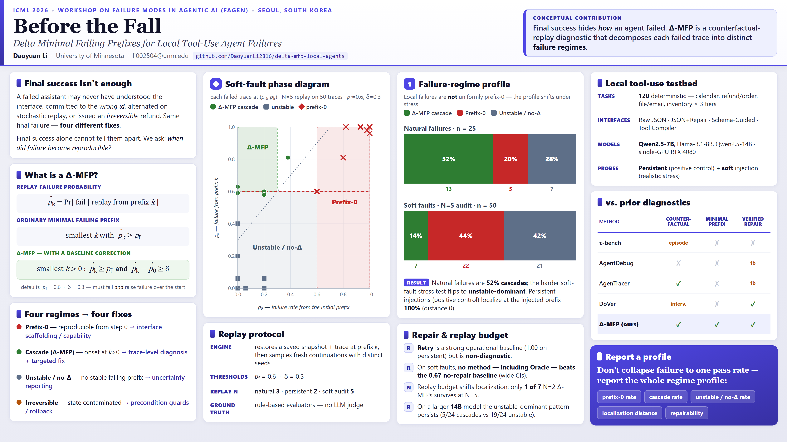

# Delta-MFP for Local Tool-Use Agents

**When a local tool-use agent fails, did the failure already reproduce from
the initial state, or did the trajectory enter a later failure basin?**

[](https://github.com/DaoyuanLi2816/delta-mfp-local-agents/actions/workflows/ci.yml)
[](https://openreview.net/forum?id=KAA8FR6fEq)
[](LICENSE)

This is the public artifact for:

> **Before the Fall: Delta Minimal Failing Prefixes for Local Tool-Use Agent
> Failures** — Daoyuan Li, University of Minnesota Twin Cities. Accepted at
> the **ICML 2026 Workshop on Failure Modes in Agentic AI (FAGEN)**,
> non-archival.

- [OpenReview paper](https://openreview.net/forum?id=KAA8FR6fEq)
- [Final PDF](paper/main.pdf)
- [Paper-to-artifact map](docs/PAPER_TO_ARTIFACT.md)

## Poster

The poster summarizes the Delta-MFP definition, replay phase diagram, observed
failure-regime profiles, and the diagnostic implications of finite replay
budgets. Click the image for the full-resolution 4096×2304 PNG.

[](paper/poster.png)

Delta Minimal Failing Prefix (Delta-MFP) is a counterfactual-replay diagnostic
for stateful tool-use agents. Given a failed trace, it estimates the replay
failure probability `p_k` at each saved prefix and compares it with `p_0` from
the initial state. With the paper's `p_fail=0.6` and `delta=0.3`, it separates:

- **prefix-0:** the initial state already fails with high probability;
- **nontrivial Delta-MFP:** a later prefix both crosses `p_fail` and increases
  failure probability by at least `delta`;
- **unstable / no-Delta:** replay does not support a stable attribution;
- **irreversible / costly:** replay alone is not a sufficient repair model.

## Published findings

| Probe | Released result | Interpretation |
|---|---:|---|
| Natural failures, `N=3` | 13/25 nontrivial, 5/25 prefix-0, 7/25 unstable | Natural local-agent failures occupy different replay regimes. |
| Persistent injections, `N=2` | 40/40 localize at the injected prefix | Positive control for snapshot restoration and replay. |
| Soft perturbations, full `N=5` | 7/50 nontrivial, 22/50 prefix-0, 21/50 unstable/no-Delta | Quiet perturbations often do not create stable replay basins. |
| Soft `N=2` → `N=5` | 37/50 keep their regime; only 1/7 earlier nontrivial localizations survives | Low replay budgets can change per-trace attribution even when aggregate counts look stable. |
| Qwen2.5-14B probe, `N=3` | 5/24 nontrivial, 19/24 unstable, 0 prefix-0 | The unstable-dominant pattern persists in the larger-model probe. |

These counts are executable claims:

```bash
python scripts/verify_paper_claims.py
```

The verifier uses only bundled tasks, traces, CSVs, and the final paper hash.
It needs no GPU, Ollama server, model weights, or network access.

## Quick start

Python 3.10+ is supported.

```bash
python -m pip install -e ".[dev]"
python -m pytest
python scripts/verify_paper_claims.py
```

To regenerate the publication figures and compact tables from the committed
result CSVs:

```bash
python code/plotting/make_figures.py \
  --out reproduced/figures \
  --tables-out reproduced/tables
```

## Model-backed reproduction

The original experiments used local Ollama inference on one NVIDIA RTX 4080
(16 GB VRAM).

| Model | Quantization | Role |
|---|---|---|
| `qwen2.5:7b` | Q4_K_M | main model and repeated replay |
| `llama3.1:8b` | Q4_K_M | calibration and part of the soft set |
| `qwen2.5:14b` | Q4_K_M | calibration and cross-model probe |

Decoding uses temperature `0.35`, `num_predict=64`, and one syntax-repair retry
at `0.1`. See [Reproducibility](docs/REPRODUCIBILITY.md) for exact commands,
budgets, runtime scope, and the distinction between verifying released results
and rerunning model observations.

## Repository layout

```text
code/           agent interfaces, simulator, replay, repairs, analysis, drivers
data/tasks/     120 deterministic tasks
data/traces/    retained natural, persistent, and soft failed traces
data/processed/ result CSVs used by the paper
figures/        camera-ready figure exports
scripts/        no-GPU artifact and release verification
tests/          deterministic replay, metric, task, and paper-claim tests
docs/           results, reproduction levels, and paper-to-artifact map
paper/          final PDF, citation, and checksum
```

## Scope and limitations

This is a controlled diagnostic suite, not a population estimate for all
agents or repositories. Natural failures are rare and selected from calibrated
cells. Persistent faults are simulator-state positive controls. Soft and
repair cells are small, and the repair experiment is intentionally reported
with Wilson intervals as a diagnostic rather than a ranking. Replay
classification depends on finite `N`; unstable/no-Delta is a substantive
outcome, not a row to discard.

## Citation and license

See [CITATION.cff](CITATION.cff) and [paper/citation.bib](paper/citation.bib).
The workshop is non-archival; cite the OpenReview workshop paper, not an ICML
main-conference or PMLR proceeding.

Code and the released artifact are under the [MIT License](LICENSE).
